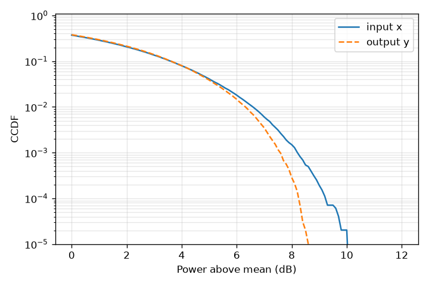
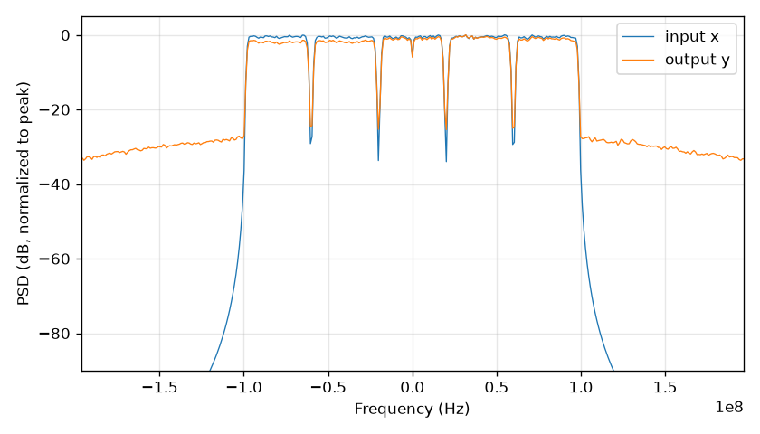
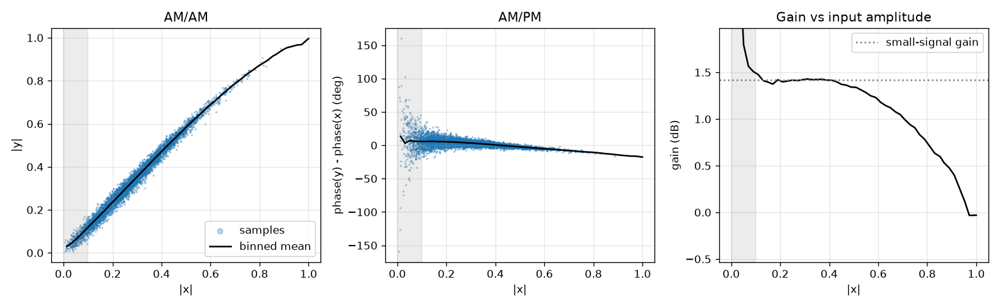
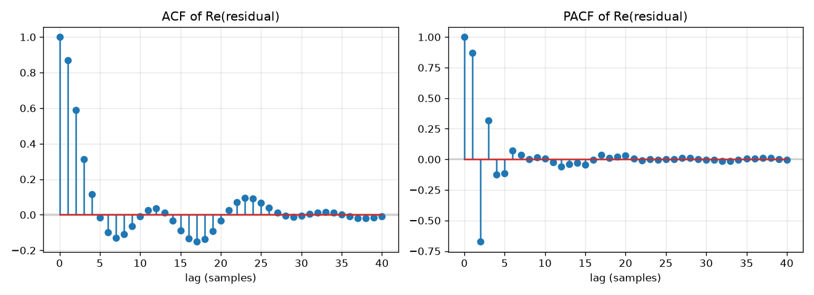

# Signal analysis — APA_200MHz (OpenDPD)

Roadmap steps 1.6 and IC-02. Generated by `experiments/signal_analysis.py`;
all numbers come from [`results.json`](apa-200mhz/results.json). The three
provider splits are analyzed as one contiguous record (train → validation →
test). Dataset provenance and license:
`characterization/data/apa_200mhz/SOURCE.md`.

```bash
uv run --group experiments python experiments/signal_analysis.py \
    --opendpd characterization/data/apa_200mhz --out docs/analysis/apa-200mhz
```

## Summary

- **Modulated wideband excitation:** 5-carrier LTE TM3.1a (256-QAM),
  200 MHz occupied bandwidth, sampled at 983.04 MS/s, input PAPR 10.0 dB.
- **Clean and aligned data:** no missing values, small DC (0.25 % of RMS),
  zero input/output delay.
- **No repetition:** unlike `dadosIniciais.csv`, the waveform does not
  repeat, so validation and test measure generalization to unseen signal.
- **Clearly nonlinear PA:** 1.45 dB of gain compression at the peak, 22° of
  AM/PM, peaks compressed (output PAPR 8.7 dB) and strong spectral regrowth
  about 30 dB below the in-band level.
- **Memory effects are visible:** the AM/AM cloud is wide, and the residual
  of the linear gain stays correlated for about 5 samples.
- **Sanity check:** a linear complex gain (|g| = 1.163, −0.10°) gives
  NMSE = −19.63 dB on the whole record (−19.58 / −19.74 / −19.68 dB on
  train / validation / test with the gain fitted on train).

## Dataset and data quality

| Item | Value |
|---|---|
| Samples | 98 304 (train 58 980, validation 19 662, test 19 662) |
| Sampling rate | 983.04 MS/s (from `spec.json`) |
| Signal | LTE TM3.1a, 5 × 40 MHz carriers (200 MHz), 256-QAM |
| Device | 3.5 GHz Ampleon GaN PA, 41.5 dBm average output power (upstream release notes) |
| Missing values | none |
| DC offset relative to RMS, x / y | 2.5 × 10⁻³ / 2.5 × 10⁻³ |
| Input → output delay | 0 samples |
| Periodicity | none found (no candidate period below the repetition tolerance) |
| Normalization | both signals scaled to a peak magnitude of 1 by the provider |

## Envelope statistics



| | PAPR |
|---|---|
| Input x | 10.01 dB |
| Output y | 8.65 dB |

The input CCDF has the shape expected for an OFDM signal. The output curve
separates from the input above about 5 dB and ends 1.36 dB earlier: the PA
**compresses the envelope peaks**. These are the samples a DPD must expand.

## Spectrum



| Power fraction | Occupied bandwidth x | Occupied bandwidth y |
|---|---|---|
| 99 % | 193.9 MHz | 193.9 MHz |
| 99.9 % | 195.8 MHz | 272.6 MHz |

- The five carriers fill ±100 MHz; the notches at ±20 MHz and ±60 MHz are
  the boundaries between carriers (centered at 0, ±40 and ±80 MHz). The dip
  at 0 Hz is consistent with the unused DC subcarrier of the central LTE
  carrier.
- Outside the band the input falls below −90 dB (relative to the in-band
  level) within about 20 MHz, while the output keeps a regrowth floor around
  −27 to −33 dB across the whole displayed range.
- At 99.9 % power the output occupies 272.6 MHz against 195.8 MHz at the
  input: the spectral regrowth is about 77 MHz wider. Adjacent-channel
  metrics (ACPR/ACEPR) are planned in IC-23.

## Static nonlinearity



| Item | Value |
|---|---|
| Small-signal gain (median over 10–40 % of max \|x\|) | 1.42 dB |
| Gain expansion (maximum above small-signal gain) | +0.06 dB |
| Gain compression at the peak | 1.45 dB |
| AM/PM span | 23.6° |
| AM/PM at the peak, relative to small signal | −22.1° |

Bins below 10 % of the maximum input amplitude (shaded) are excluded from
these numbers: there the noise dominates |y| and biases the binned gain
upward.

The gain is flat up to |x| ≈ 0.4 and then compresses steadily, reaching
1.45 dB at the peak. The phase shift decreases monotonically with amplitude
(−22° at the peak). Both AM/AM and AM/PM distortion are significant. The
cloud of samples around the binned curves is much wider than for
`dadosIniciais.csv`: the output depends on the signal history, not only on
the current amplitude, which is the signature of **memory effects**
(expected for a GaN PA driven by a 200 MHz signal).

## Time-series diagnostics

Analyses on the residual of the best linear complex gain, r = y − g·x.

| Series | ADF p-value | KPSS p-value | Stationary? |
|---|---|---|---|
| Re(x) | 5 × 10⁻³⁰ | ≥ 0.10 | yes |
| Im(x) | 5 × 10⁻²⁹ | ≥ 0.10 | yes |
| \|x\| | < 10⁻³⁰ | ≥ 0.10 | yes |
| Re(r) | < 10⁻³⁰ | ≥ 0.10 | yes |

KPSS p-values are clipped by statsmodels at 0.10. The signal is band-limited
and oversampled, so the ADF lag regressions are nearly collinear and
statsmodels warns that the design matrix is rank-deficient; the script
silences that warning. All series are stationary: no differencing is needed.



| Item | Value |
|---|---|
| Linear-gain model NMSE | −19.63 dB |
| ACF of Re(r), lags 1–5 | 0.87, 0.59, 0.31, 0.12, −0.02 |
| Ljung–Box p-value, lags 5 / 10 / 20 | < 10⁻¹⁰ (all) |

The residual is not white. Its ACF falls to about zero after 4–5 lags and
then oscillates weakly; the PACF is significant up to about lag 5. Part of
this correlation comes from oversampling (the signal occupies about 20 % of
the sampling band) and part from the nonlinear distortion itself, so the
exact memory depth must still be confirmed with the residual of a nonlinear
model (roadmap step 1.4).

## Comparison with `dadosIniciais.csv`

| Item | dadosIniciais.csv | APA_200MHz |
|---|---|---|
| Excitation | two tones | 5-carrier LTE, 200 MHz |
| Input PAPR | 3.4 dB | 10.0 dB |
| Waveform repeats | yes (18 periods) | no |
| Gain compression at peak | 0.30 dB | 1.45 dB |
| AM/PM span | 11.2° | 23.6° |
| Linear-gain NMSE | −25.8 dB | −19.6 dB |
| Memory (AM/AM spread, residual ACF) | weak | visible, about 5 samples |

APA_200MHz is the harder and more representative dataset: higher PAPR,
stronger compression, visible memory and no repetition. It is the main
dataset for model comparison; `dadosIniciais.csv` remains a complementary,
mildly nonlinear case.

## Conclusions for modeling

- **Nonlinearity order.** Strong compression and AM/PM: test odd orders up
  to at least 7, and fractional exponents (FMP) as planned.
- **Memory depth.** Start the search around M = 3 to 7 and confirm with the
  residual of a nonlinear memoryless model.
- **Baseline to beat.** The linear gain gives −19.6 dB NMSE; every model is
  reported against it.
- **Data split.** Use the provider's split as-is; it is contiguous and the
  waveform does not repeat.
