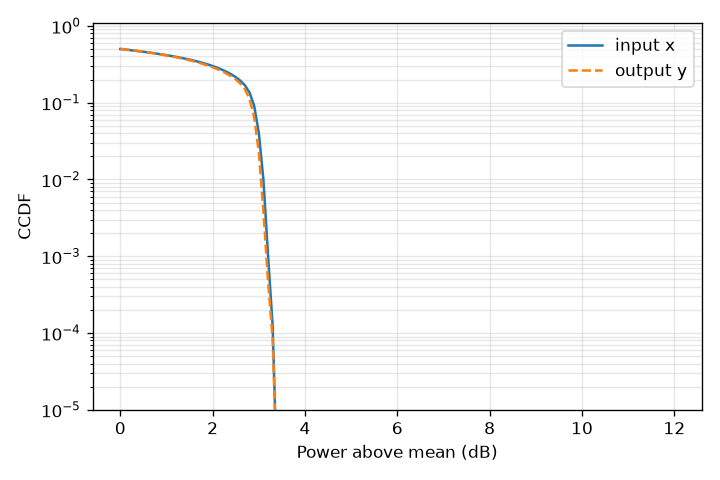
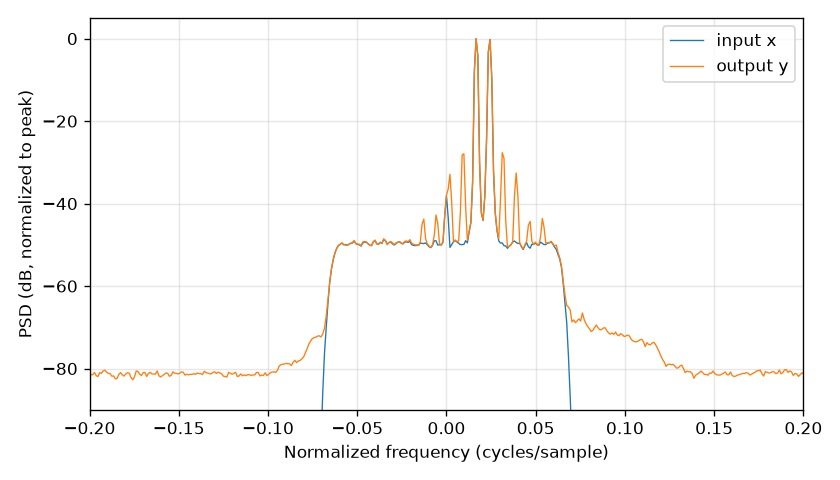
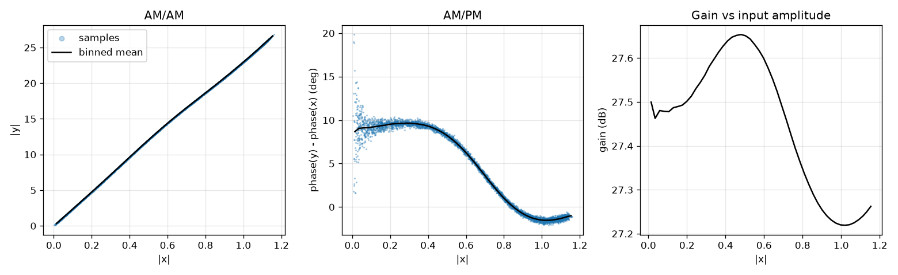
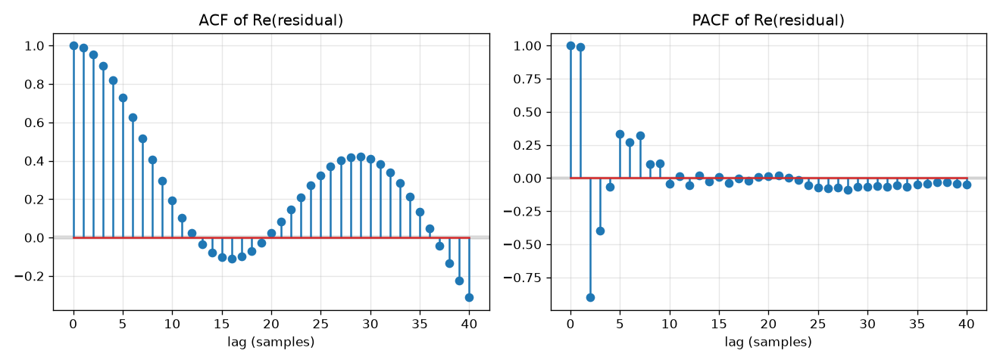

# Signal analysis — `dadosIniciais.csv`

Roadmap step 1.6. Generated by `experiments/signal_analysis.py`; all numbers
come from [`results.json`](dados-iniciais/results.json). Re-run the script to
update them:

```bash
uv run --group experiments python experiments/signal_analysis.py
```

## Summary

- The excitation is a **two-tone test**, not a modulated (OFDM-like) signal:
  two equal-power tones plus a weak band-limited floor 50 dB below them.
- The data are **clean and aligned**: no missing values, negligible DC,
  zero input/output delay.
- The input **repeats every 2688 samples** (18 periods in the file).
- The PA is **mildly nonlinear**: 0.43 dB of gain variation, 11° of AM/PM,
  intermodulation products up to the seventh order, and spectral regrowth
  outside the input band. Third-order intermodulation is at
  −27 dBc, fifth order at −33 dBc and seventh order at −44 dBc.
- A linear gain alone already reaches **−25.8 dB NMSE**; the remaining error
  is deterministic nonlinear distortion, so nonlinear models are needed.

## Dataset and data quality

| Item | Value |
|---|---|
| Samples | 48 384 complex input/output pairs |
| Sampling rate | unknown — frequencies are normalized (cycles/sample) |
| Missing values | none |
| DC offset relative to RMS, x / y | 1.6 × 10⁻⁴ / 1.6 × 10⁻⁴ |
| Input → output delay | 0 samples |
| Input period | 2688 samples, repeated 18 times (normalized repetition error 0.069) |

The repetition is not exact (error 0.069 of the peak amplitude), which is
consistent with the same waveform measured 18 times with measurement noise.
Every multiple of 2688 is also a period; the script reports the smallest one.

**Implication for modeling.** Any contiguous train/validation/test split
contains complete periods of the *same* waveform. Validation and test scores
therefore measure generalization to new **noise**, not to new **signals**.
Generalization to unseen waveforms has to be checked on a second dataset
(APA_200MHz, roadmap IC-02).

## Envelope statistics



| | PAPR |
|---|---|
| Input x | 3.38 dB |
| Output y | 3.36 dB |

Two equal-power tones have a PAPR of 3.01 dB; the measured 3.38 dB matches
that, plus the weak floor. The output CCDF lies on top of the input CCDF,
with a slight reduction near the peaks: the PA barely compresses the
envelope at this drive level.

**Limitation.** A two-tone signal does not exercise the high peaks of
modulated signals (an OFDM signal typically has a PAPR near 10 dB), so
models fitted here are validated only over this amplitude range.

## Spectrum



| Power fraction | Occupied bandwidth x | Occupied bandwidth y |
|---|---|---|
| 99 % | 0.0098 | 0.0098 |
| 99.9 % | 0.0098 | 0.0303 |

Main input tones at 0.01674 and 0.02418 cycles/sample (spacing 0.00744).

- The output shows intermodulation (IM) products at multiples of the tone
  spacing on both sides. Levels relative to a main tone (exact FFT of the
  full record):

  | Product | Frequencies | Input x | Output y |
  |---|---|---|---|
  | IM3 | 0.0093, 0.0316 | −67, −63 dBc | −27, −27 dBc |
  | IM5 | 0.0019, 0.0391 | −69, −66 dBc | −33, −33 dBc |
  | IM7 | −0.0056, 0.0465 | −64, −65 dBc | −44, −45 dBc |

  The input is clean (all products below −60 dBc); the products in the
  output are created by the PA, and they are symmetric, which is consistent
  with weak memory effects.
- Outside the input band (|f| > 0.07) the input drops below −90 dB, while
  the output keeps a regrowth skirt between about −65 and −80 dB.
- At 99 % power both signals occupy the same band, because the tones carry
  almost all the energy. At 99.9 % the output band is about **3 times
  wider**: the spectral regrowth caused by the nonlinearity.

## Static nonlinearity



| Item | Value |
|---|---|
| Small-signal gain | 27.50 dB |
| Maximum gain (near \|x\| ≈ 0.5) | 27.65 dB |
| Minimum gain (near \|x\| ≈ 1.0) | 27.22 dB |
| Gain variation over the input range | 0.43 dB |
| AM/PM span | 11.2° |

The gain first **expands** (+0.15 dB) and then **compresses** (−0.28 dB
relative to small signal). The phase shift is almost flat near 9–10° up to
|x| ≈ 0.4 and then falls to about −1.5° near |x| ≈ 1.0: the AM/PM
distortion (11°) is more significant than the AM/AM distortion. The
scatter at very low amplitude is noise (low signal-to-noise ratio). The
AM/AM cloud is thin, which suggests weak memory effects.

## Time-series diagnostics

Analyses on the residual of the best linear complex gain, r = y − g·x.

| Series | ADF p-value | KPSS p-value | Stationary? |
|---|---|---|---|
| Re(x) | 8 × 10⁻²⁸ | ≥ 0.10 | yes |
| Im(x) | 5 × 10⁻²⁸ | ≥ 0.10 | yes |
| \|x\| | < 10⁻³⁰ | ≥ 0.10 | yes |
| Re(r) | < 10⁻³⁰ | ≥ 0.10 | yes |

KPSS p-values are clipped by statsmodels at 0.10, so "≥ 0.10" means the test
does not reject stationarity. All series are stationary, as expected for a
periodic test signal: no differencing is needed.



| Item | Value |
|---|---|
| Linear-gain model NMSE | −25.77 dB |
| ACF of Re(r), lags 1–5 | 0.99, 0.95, 0.90, 0.82, 0.73 |
| Ljung–Box p-value, lags 5 / 10 / 20 | < 10⁻¹⁰ (all) |

The residual is far from white. Its ACF oscillates slowly and the PACF is
significant up to about lag 9. Two causes overlap here and cannot be
separated by this analysis:

1. the residual is dominated by the **intermodulation products**, which are
   deterministic narrowband components, so consecutive samples are strongly
   correlated;
2. the signal is heavily **oversampled** (energy below |f| ≈ 0.07), which
   also correlates neighboring samples.

So the correlation shows **nonlinearity**, not necessarily memory. The
memory depth must be estimated from the residual of a **nonlinear
memoryless** model (roadmap step 1.4).

## Conclusions for modeling

- **Nonlinearity order.** Intermodulation is visible up to the seventh
  order, so polynomial models should be tested with odd orders up to at
  least 7.
- **Memory depth.** This analysis cannot isolate memory from nonlinearity.
  Start with small depths (M = 1 to 5) and decide with the residual of the
  nonlinear memoryless model.
- **Data split.** The waveform repeats; validation and test on this dataset
  measure noise generalization only.
- **Limitations.** Unknown sampling rate (frequencies normalized), unknown
  measurement setup, and a low-PAPR two-tone excitation that does not cover
  the high-peak regime of modulated signals.
